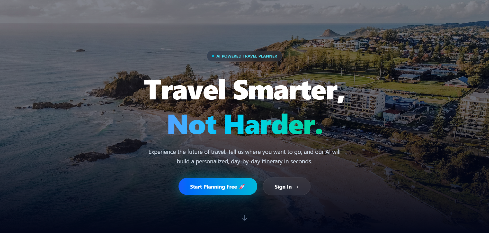
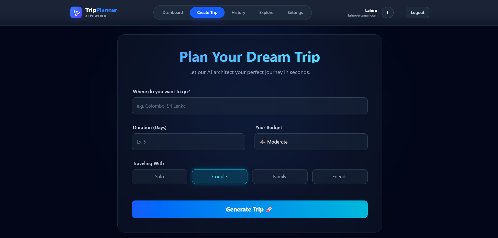
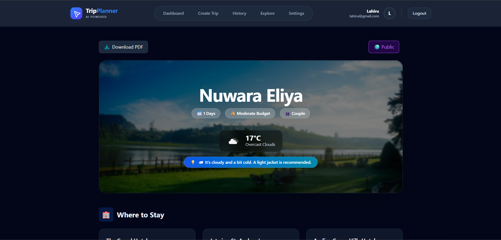
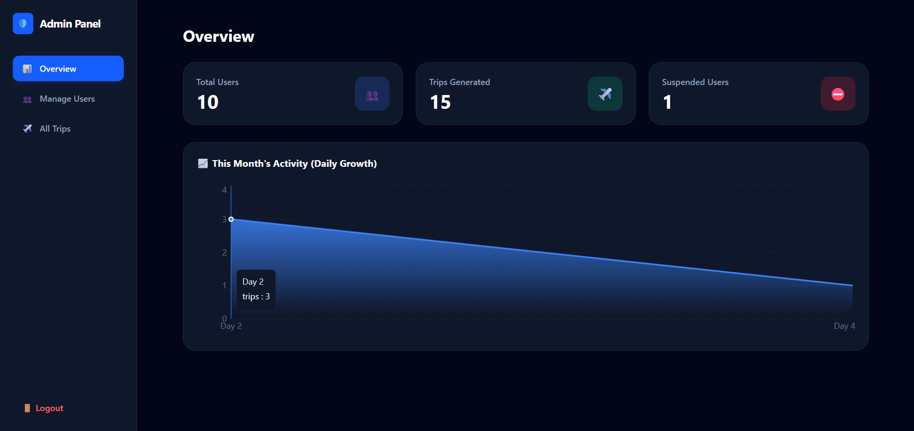

# 🌍 AI Travel Planner - Frontend

> A modern, AI-powered travel itinerary generator built with React, TypeScript, and Tailwind CSS. It features a stunning dark glassmorphism UI, interactive maps, and a comprehensive user dashboard.

## 🚀 Live Demo
**Frontend URL:** [[Link to your Vercel Deployment](https://ai-travel-planner-fe.vercel.app/)]
**Backend Repository:** [[Link to Backend GitHub Repo](https://github.com/Lahiru075/AI-travel-planner-be.git)]

---

## 🛠️ Technologies & Tools

*   **Framework:** React.js (Vite)
*   **Language:** TypeScript
*   **Styling:** Tailwind CSS (Custom Dark Theme & Glassmorphism)
*   **State Management:** React Context API
*   **Routing:** React Router Dom
*   **HTTP Client:** Axios
*   **Maps:** React Leaflet (OpenStreetMap)
*   **Charts:** Recharts
*   **Notifications:** Sonner & SweetAlert2
*   **Auth:** Google OAuth (@react-oauth/google)

---

## ✨ Key Features

### 1. 🤖 AI Trip Generation
*   User-friendly form to collect destination, budget, and travel companions.
*   Interacts with Google Gemini to generate detailed day-by-day plans.
*   **Smart Features:**
    *   **Live Weather:** Real-time weather updates for the destination.
    *   **Packing Tips:** AI-suggested packing list based on weather.
    *   **Interactive Map:** Pins locations on a map using Leaflet.

### 2. 🎨 Modern UI/UX
*   **Glassmorphism Design:** Premium dark theme with blurred glass effects.
*   **Responsive:** Fully optimized for Mobile, Tablet, and Desktop.
*   **Dynamic Backgrounds:** Fetches high-quality city images via Unsplash API.

### 3. 👤 User Dashboard & History
*   View all saved trips in a responsive grid layout.
*   **Pagination:** Efficiently browse through travel history.
*   **Delete & Manage:** Remove unwanted trips with confirmation alerts.

### 4. 🌍 Community & Explore
*   **Publish Trips:** Share your itinerary with the community.
*   **Clone Trips:** Save a copy of other users' trips to your own profile.
*   **Search:** Filter public trips by destination.

### 5. 🛡️ Admin Dashboard
*   **Overview Stats:** View total users, trips, and system growth.
*   **Charts:** Visual analytics of monthly trip generation.
*   **User Management:** Suspend or Activate users.
*   **Trip Management:** Moderate and delete inappropriate trips.

### 6. 📄 PDF Export
*   Download the complete itinerary as a clean, printable PDF file using the native browser print API.

---

## 📸 Screenshots

*(Please replace the links below with your actual screenshots)*

### 🏠 Landing Page


### 📝 Trip Generation Form


### 🗺️ Itinerary View (With Map & Weather)


### 📊 Admin Dashboard


---

## ⚙️ Environment Variables

Create a `.env` file in the root directory and add the following:

```env
VITE_GOOGLE_CLIENT_ID=your_google_client_id_here
```

## 💻 Setup & Installation

1.  **Clone the repository**
    ```bash
    git clone https://github.com/Lahiru075/AI-travel-planner-fe.git
    cd your-frontend-repo
    ```

2.  **Install Dependencies**
    ```bash
    npm install
    ```

3.  **Run the Development Server**
    ```bash
    npm run dev
    ```

4.  **Build for Production**
    ```bash
    npm run build
    ```

## 📂 Project Structure

```bash
src/
├── assets/         # Images and static files
├── components/     # Reusable UI components (Navbar, TripCard, Map, etc.)
├── context/        # Auth Context for global state management
├── pages/          # Main application pages (Home, Dashboard, CreateTrip, Admin)
├── routes/         # App navigation & protected route logic (index.tsx)
├── service/        # API service functions (Axios calls to Backend)
├── App.tsx         # Root component
└── main.tsx        # Entry point
```

## 👨‍💻 Author

*   **Lahiru Lakshan** - [GitHub Profile](https://github.com/Lahiru075)

  
